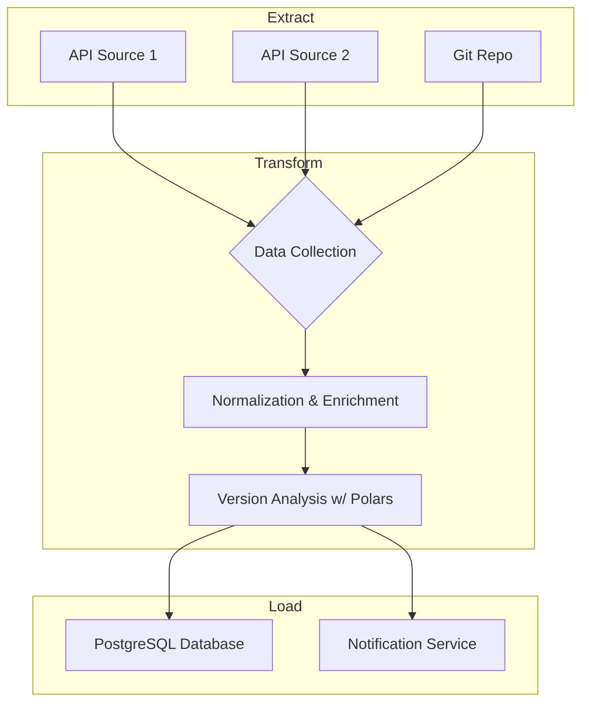

# Architecture

This document outlines the architecture of the VersionWatch ETL project.

## 1. High-Level Design

VersionWatch follows a classic ETL (Extract, Transform, Load) pattern. The system is designed as a modular Rust workspace to ensure separation of concerns and scalability.



## 2. Project Structure (Multi-Crate Workspace)

To manage complexity and promote code reuse, the project is structured as a Cargo workspace.

```
versionwatch/
├── Cargo.toml         # Workspace definition
├── .gitignore
├── README.md
├── ARCHITECTURE.md
├── Dockerfile
├── config/
│   └── base.yml       # Configuration for software targets
├── crates/
│   ├── versionwatch-cli/    # Main binary, orchestrates the ETL flow
│   │   ├── Cargo.toml
│   │   └── src/
│   ├── versionwatch-core/   # Domain types (SoftwareVersion) and shared logic
│   │   ├── Cargo.toml
│   │   └── src/
│   ├── versionwatch-collect/ # Data collection from external sources
│   │   ├── Cargo.toml
│   │   └── src/
│   ├── versionwatch-config/ # Configuration loading and management
│   │   ├── Cargo.toml
│   │   └── src/
│   └── versionwatch-db/       # Database interactions (PostgreSQL with SQLx)
│       ├── Cargo.toml
│       └── src/
└── target/
```

- **`versionwatch-cli`**: The main application crate that parses arguments, loads configuration, and orchestrates the extract, transform, and load steps.
- **`versionwatch-core`**: Contains the primary domain models like `SoftwareVersion` and other shared logic that is used across the workspace.
- **`versionwatch-collect`**: Each data source (e.g., Node.js API, Docker Hub) will be a module within this crate. It's responsible for fetching raw data.
- **`versionwatch-config`**: Handles loading and parsing the `config/base.yml` file.
- **`versionwatch-db`**: Manages the database connection pool and queries using `sqlx`.

## 3. Data Flow & The Role of Polars

1.  **Extract**: The `versionwatch-collect` crate fetches version data from various APIs.
2.  **Transform**: The raw data (often JSON) is collected and loaded into a **Polars DataFrame**. Polars is used here for its high-performance data manipulation capabilities:
    - Normalizing data from different sources into the `SoftwareVersion` schema.
    - Filtering out disabled targets based on configuration.
    - Comparing `current_version` against `latest_version`.
    - Enriching data (e.g., calculating `cve_count` if applicable).
3.  **Load**: The transformed data from the Polars DataFrame is then upserted into the PostgreSQL database via the `versionwatch-db` crate.

## 4. Database Schema (PostgreSQL 17)

We use `sqlx` for database interaction, including migrations.

The primary table is `software_versions`:

```sql
CREATE TABLE software_versions (
    id SERIAL PRIMARY KEY,
    name VARCHAR(255) NOT NULL UNIQUE,
    -- The `current_version` is intended to be populated by an external system.
    -- This ETL is responsible for collecting public version data, not local state.
    current_version VARCHAR(255),
    latest_version VARCHAR(255) NOT NULL,
    is_lts BOOLEAN DEFAULT FALSE,
    eol_date DATE,
    release_notes_url TEXT,
    cve_count INTEGER DEFAULT 0,
    created_at TIMESTAMPTZ NOT NULL DEFAULT NOW(),
    updated_at TIMESTAMPTZ NOT NULL DEFAULT NOW()
);

-- Trigger to automatically update updated_at timestamp
CREATE OR REPLACE FUNCTION trigger_set_timestamp()
RETURNS TRIGGER AS $$
BEGIN
  NEW.updated_at = NOW();
  RETURN NEW;
END;
$$ LANGUAGE plpgsql;

CREATE TRIGGER set_timestamp
BEFORE UPDATE ON software_versions
FOR EACH ROW
EXECUTE FUNCTION trigger_set_timestamp();
```

## 5. Configuration

The application's behavior is controlled by `.yml` files in the `/config` directory. This allows users to enable or disable tracking for specific software without changing the code.

Example `config/base.yml`:
```yml
targets:
  - name: "node"
    enabled: true
  - name: "docker"
    enabled: true
  - name: "rust"
    enabled: false
``` 