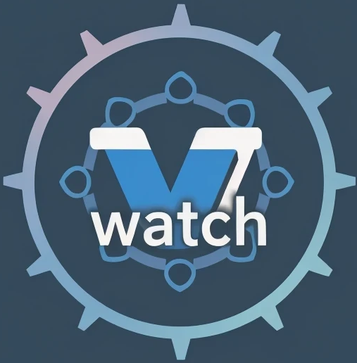

<!-- PROJECT SHIELDS -->
[![Contributors][contributors-shield]][contributors-url]
[![Forks][forks-shield]][forks-url]
[![Stargazers][stars-shield]][stars-url]
[![Issues][issues-shield]][issues-url]
[![MIT License][license-shield]][license-url]

<!-- PROJECT LOGO -->
<br />
<div align="center">
  <a href="https://github.com/mpiton/versionwatch">
    
  </a>

<h3 align="center">VersionWatch</h3>

  <p align="center">
    An ETL to track and manage software dependency versions.
    <br />
    <a href="https://github.com/mpiton/versionwatch"><strong>Explore the docs »</strong></a>
    <br />
    <br />
    <a href="https://github.com/mpiton/versionwatch/issues">Report Bug</a>
  </p>
</div>

<!-- TABLE OF CONTENTS -->
<details>
  <summary>Table of Contents</summary>
  <ol>
    <li>
      <a href="#about-the-project">About The Project</a>
      <ul>
        <li><a href="#built-with">Built With</a></li>
      </ul>
    </li>
    <li>
      <a href="#getting-started">Getting Started</a>
      <ul>
        <li><a href="#prerequisites">Prerequisites</a></li>
        <li><a href="#installation">Installation</a></li>
      </ul>
    </li>
    <li><a href="#usage">Usage</a></li>
    <li><a href="#roadmap">Roadmap</a></li>
    <li><a href="#contributing">Contributing</a></li>
    <li><a href="#license">License</a></li>
    <li><a href="#contact">Contact</a></li>
    <li><a href="#acknowledgments">Acknowledgments</a></li>
  </ol>
</details>

<!-- ABOUT THE PROJECT -->
## About The Project

VersionWatch is an ETL (Extract, Transform, Load) tool built in Rust, designed to automate the monitoring of software dependency versions. It helps you keep track of updates, security vulnerabilities, and end-of-life dates for technologies like Node.js, Docker, Rust, Python, and more.

Key features include:
*   **Automated Version Tracking**: Automatically collects version information from various sources.
*   **Security Monitoring**: Identifies security vulnerabilities in your dependencies. (work in progress)
*   **End-of-Life Alerts**: Notifies you about dependencies approaching their end-of-life. (work in progress)
*   **Configurable**: Select which software targets to monitor through simple `.yml` configuration.
*   **Data-Driven**: Uses Polars DataFrames for efficient data transformation.

### Built With

*   [![Rust][Rust-shield]][Rust-url]
*   [![PostgreSQL][PostgreSQL-shield]][PostgreSQL-url]
*   [![Docker][Docker-shield]][Docker-url]

<!-- GETTING STARTED -->
## Getting Started

Follow these steps to get a local copy up and running.

### Prerequisites

*   **Rust**: Make sure you have the Rust toolchain installed. You can get it from [rust-lang.org](https://www.rust-lang.org/tools/install).
*   **Docker**: Docker is required to run the PostgreSQL database. Get it from [docker.com](https://www.docker.com/products/docker-desktop).
*   **GitHub Personal Access Token**: You'll need a GitHub PAT to fetch data from GitHub's APIs.

### Installation

1.  **Clone the repository**:
    ```sh
    git clone https://github.com/mpiton/versionwatch.git
    cd versionwatch
    ```
2.  **Install git hooks** (recommended):
    ```sh
    ./scripts/install-hooks.sh
    ```
    This sets up pre-commit hooks that automatically check code formatting, linting, and security before each commit.

3.  **Set up your environment**:
    Create a `.env` file from the example and add your GitHub PAT:
    ```sh
    cp .env.example .env
    echo "GITHUB_PAT=your_github_personal_access_token" >> .env
    ```
4.  **Launch the database**:
    ```sh
    docker-compose up -d db
    ```
5.  **Run database migrations**:
    ```sh
    cargo run -- migrate
    ```
6.  **Run the ETL**:
    ```sh
    cargo run -- etl
    ```

## Architecture

VersionWatch is structured as a Cargo workspace with multiple crates, each responsible for a specific part of the ETL process:

*   `versionwatch-cli`: Command-line interface for user interaction.
*   `versionwatch-core`: Core business logic and data structures.
*   `versionwatch-collect`: Data extraction from various sources.
-   `versionwatch-config`: Handles configuration from `.yml` files.
*   `versionwatch-db`: Database interactions and data loading.

The data flows through the system as follows:
1.  **Extract**: The `versionwatch-collect` crate fetches data.
2.  **Transform**: Data is converted into a unified `SoftwareVersion` schema using Polars DataFrames.
3.  **Load**: The `versionwatch-db` crate loads the transformed data into a PostgreSQL 17 database.

## Development

### Code Quality

This project uses automated code quality checks:

*   **Formatting**: Code is automatically formatted using `cargo fmt`
*   **Linting**: Static analysis with `cargo clippy` to catch common mistakes
*   **Security**: Dependency vulnerability scanning with `cargo audit`

### Git Hooks

Pre-commit hooks are available to ensure code quality:

```sh
# Install hooks (run once)
./scripts/install-hooks.sh

# Manual code quality checks
cargo fmt --all                                    # Format code
cargo clippy --all-targets --all-features -- -D warnings  # Lint code
cargo audit --ignore RUSTSEC-2023-0071 --ignore RUSTSEC-2024-0436  # Security audit
```

To bypass hooks temporarily (not recommended):
```sh
git commit --no-verify
```

### Continuous Integration

GitHub Actions automatically runs the same checks on every push and pull request to ensure code quality and security.

## Contributing

Contributions are what make the open source community such an amazing place to learn, inspire, and create. Any contributions you make are **greatly appreciated**.

If you have a suggestion that would make this better, please fork the repo and create a pull request. You can also simply open an issue with the tag "enhancement".
Don't forget to give the project a star! Thanks again!

1. Fork the Project
2. Create your Feature Branch (`git checkout -b feature/AmazingFeature`)
3. Install git hooks (`./scripts/install-hooks.sh`)
4. Commit your Changes (`git commit -m 'Add some AmazingFeature'`)
5. Push to the Branch (`git push origin feature/AmazingFeature`)
6. Open a Pull Request

<!-- LICENSE -->
## License

Distributed under the MIT License. See `LICENSE.txt` for more information.

<!-- MARKDOWN LINKS & IMAGES -->
[contributors-shield]: https://img.shields.io/github/contributors/mpiton/versionwatch.svg?style=for-the-badge
[contributors-url]: https://github.com/mpiton/versionwatch/graphs/contributors
[forks-shield]: https://img.shields.io/github/forks/mpiton/versionwatch.svg?style=for-the-badge
[forks-url]: https://github.com/mpiton/versionwatch/network/members
[stars-shield]: https://img.shields.io/github/stars/mpiton/versionwatch.svg?style=for-the-badge
[stars-url]: https://github.com/mpiton/versionwatch/stargazers
[issues-shield]: https://img.shields.io/github/issues/mpiton/versionwatch.svg?style=for-the-badge
[issues-url]: https://github.com/mpiton/versionwatch/issues
[license-shield]: https://img.shields.io/github/license/mpiton/versionwatch.svg?style=for-the-badge
[license-url]: https://github.com/mpiton/versionwatch/blob/master/LICENSE.txt
[Rust-shield]: https://img.shields.io/badge/Rust-000000?style=for-the-badge&logo=rust&logoColor=white
[Rust-url]: https://www.rust-lang.org/
[PostgreSQL-shield]: https://img.shields.io/badge/PostgreSQL-316192?style=for-the-badge&logo=postgresql&logoColor=white
[PostgreSQL-url]: https://www.postgresql.org/
[Docker-shield]: https://img.shields.io/badge/Docker-2496ED?style=for-the-badge&logo=docker&logoColor=white
[Docker-url]: https://www.docker.com/ 